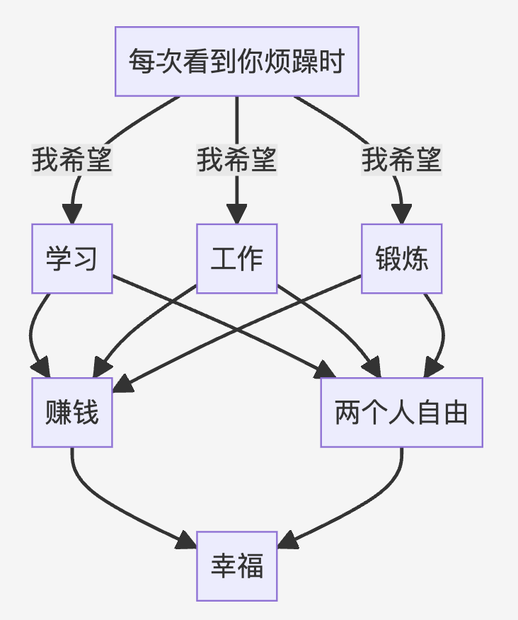
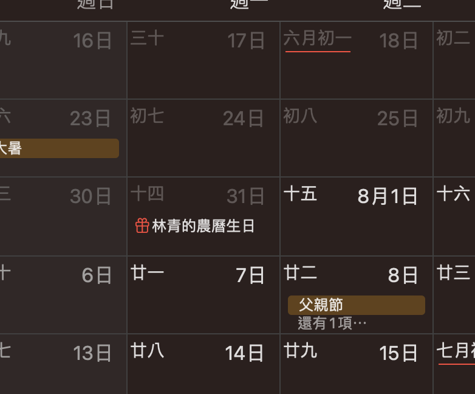

- 我明白你所为我做的这些改变。
  
  我也明白了解的过程这些痛苦。可能也正是因为我看到你的这些成长，更加希望自己去承担更多。
  
  还有一个问题，我一直努力的在撑着，没有早让你思考工作的事情。也可能导致了这些矛盾。
  
  越是紧急的问题，我越习惯抛下一切而去思考。
  
  我一直没有意识到我的这样的行为会给别人造成压力。因为不是所有人都能长时间浸泡在一个很难的事情中。
  
  #+BEGIN_QUOTE
  学习的事情，即使你分享 的东西我并不感兴趣，我也尽可能的去回应你，或者尽可能让自己也 去了解。交易很难，每次我想偷懒，可是每次看见你那么拼命在学， 我内心就有愧疚感，所以也会逼着自己必须多学一些。那会，觉得不 管是什么，难就难点吧，哪有什么事容易的，能学到东西的时候，内心也是很开心的。
  #+END_QUOTE
- 关于交易的事情，我需要道歉。我没有意识到这是一个非常难的课题，所以努力推荐给身边的人。我这个人容易这样，喜欢分享觉得好的东西。真的是打心眼里推荐那种。==我一在寻找比较完美的职业能够享有自由和成就感,同时不受任何地域限制==
  
  而我没有意识到，这个世界上真正好的东西都是需要非常刻苦用功才能得到。
  
  我原本只是天真的认为，有一个更好的，更公平的项目，也是大家希望追寻的。
  
  我在发现了交易的难之后，努力的改正自己的缺点。因为我觉得公平的游戏更能让我成熟。我不希望通过“寻租”的方式再赚钱了。
  
  关于工作与学习的问题,因为
	- 解决债务问题
	  logseq.order-list-type:: number
	- 解决两个人结婚的问题
	  logseq.order-list-type:: number
	- 自己能力更强大才能照顾好你
	  logseq.order-list-type:: number
-
- ## 当你在内疚自己做的不够好时
	- 首先，我努力做这些不是为了让你感到压力，正是看到你的内疚，又更迫使我努力工作，因为我相信更宽裕的生活能让你更放松。
	  
	  我知道你要消化我给你说一堆东西也需要很长时间消化。
	  
	  但是这些外在的压力不轻松，所以我才希望最大限度的开发自己的潜能（饮食运动看书下棋）都是希望让我尽快理解这个最难的课题。
	  
	  所有这些事情的紧迫感，当然也是自己特别擅长的领域，都迫使我更加不能让自己的生活作息有所松懈。
	  
	  所以，对饮食也是极度挑剔，任何阻碍我思考的东西都要撇开。
	- {:height 428, :width 349}
-
- ## 关于生日
	- 这是我的记录，因为我容易忘这个事情，特地记在日历了
	- {:height 458, :width 387}
-
- ## 关于忽略你的感受
	- 我一直认为经济是我们最大的难题，所以这是我在努力解决的。
	  
	  还有就是，很多时候你的情绪，我不知道有什么更好的方式可以照顾。因为当时我认为首要问题是解决经济。
	  
	  而很多时候，在很多事情上你都有情绪。我不知道到底要做什么。
	  
	  忙完工作，搂搂抱抱你说不够用心。
	  
	  出去吃饭，以前我可能会放不下工作看手机，后来也很少看了。
	  
	  出门吧，以前还会去健身房，见朋友，后面也没有了。
	  
	  所以，我们一直都呆在一起。本身学业工作就非常繁重。所有的事情都搅在一起。
	  
	  后面时不时去公园，你说晒。但是我们已经很少晒太阳了，难得天气晴朗。
	  
	  你说你希望自己静一下，那好我选择尊重。
	  
	  很多时候我分不清，到底你希望要的东西。
	  
	  ---
	- #+BEGIN_QUOTE
	  其实我有时很迷茫，真的，当你知道我不开心，难过的时候，还只顾着自己的学习 工作，并且乐在其中的时候，我一遍遍在问自己，其实你真的喜欢我 吗?或许你也没那么喜欢我吧。
	  
	  #+END_QUOTE
	- 很久之前我就希望了解你迷茫的点，但是我问不出来。
	  
	  每次我问，你也更不开心，最后我就索性不问了。
	  
	  还有一个问题，你认为我的专注是只顾自己。
	  
	  解决一个很难的难题时，还要同时解说是很难的一件事情，因为当事人也在模糊不清中。