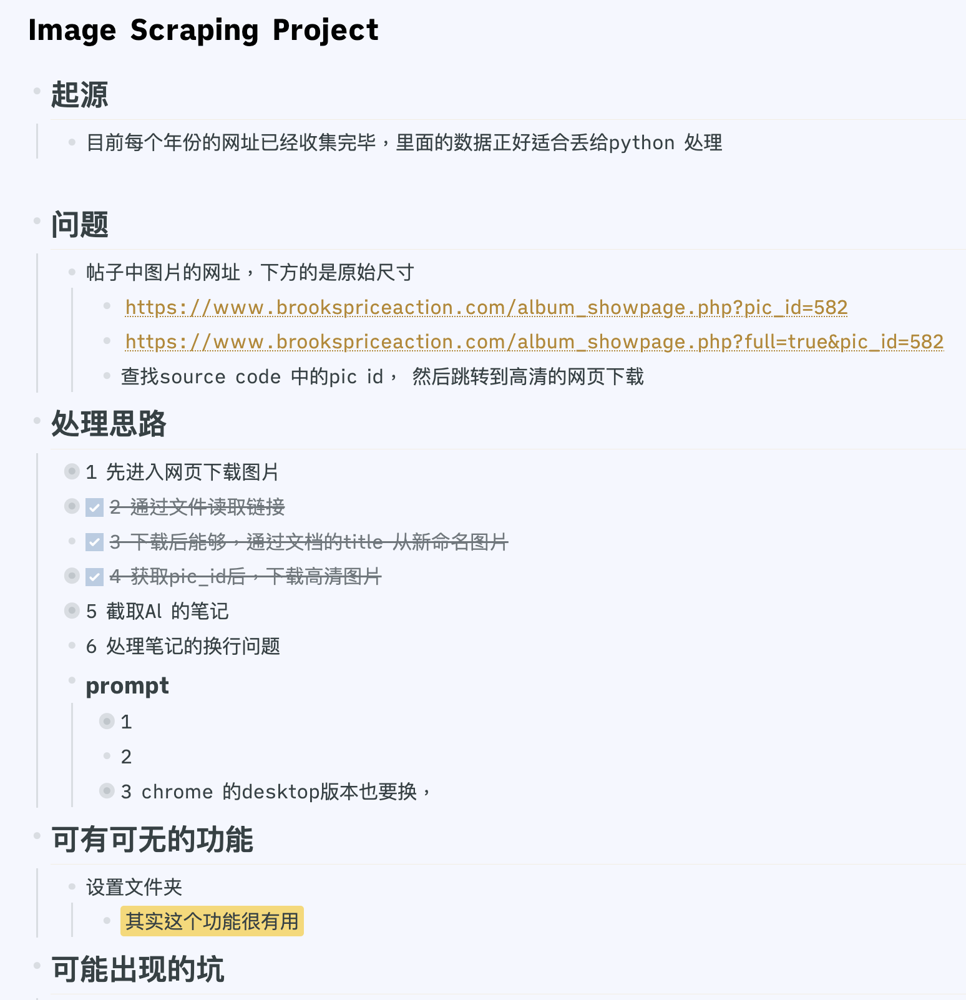

## 成果
	- 最近发现解决问题的速度比预想的快了越来越多。
	  
	  比如，做BPA论坛的爬虫，原本的计划是一周以上， 没想到在我做出这个预想后，2天不到的时间就解决了。
	  
	  一开始我都不敢想象，最早的计划是先爬去网站的目录，确保格式整齐。当时花了不少时间。 
	  
	  随着小目标的实现，发现带来的喜悦促使我想到第2 第3个项目。通过目录爬取图片。同时自动OCR批量识别图片文字（这个居然只花了几十分钟）但是酝酿了好几天。而且解决速度一个一个比一个快。但是前提是需要灵感。
	  
	  而灵感的来源是，一定要做自己喜爱的事情，不能违背自己的感受。
- ## 低效率的原因
	- 最近发现之前学习效率低下很大一个程度是没有找到合适的笔记软件。
	  
	  好的笔记软件可以让我们上瘾，同时可以辅助记忆。 还有我以前使用电脑太依赖鼠标了。鼠标非常容易让人注意力分散。
	  
	  因为需要拿鼠标，移动光标，瞄准，这里费眼神还有注意力。
	  
	  所以我找到了把电脑所有操作都变为键盘操作的办法，大大减少鼠标使用。
- ## 笔记 vs 计划
	-
	- 以前，我的笔记都是为了防止忘记而写的，没有任何条理。
	  
	  后来了解到，笔记有不同的种类，如灵感笔记（随意收集手机上的东西），和读书的节选笔记。这些都是让你上瘾地翻看手机的东西，有时我们会突然好奇某种东西，就会看很长时间。其实，观察自己会发现这些东西其实会给我们启发，以前我从来不注重这些启发。
	  
	  但现在我会把所有有趣的东西都收集起来，并加上标签。我发现收集越多，我就会越有灵感。
	  
	  然后是计划。无论何时思考，都要设定这件事的目标。通常我们编程时会想，我希望做一个爬虫，然而在实际操作过程中会遇到很多问题。
	  
	  问题本身就是关键，要想办法如何提出。例如，你向ChatGPT提出问题，如果描述得太笼统，就可能得不到你想要的效果。
	  
	  然后我们会深陷于处理各种报错中。然而这正是关键所在！
	  
	  处理任何难题都应该记录下来，比如发现了一个新难题，就要记录下来。稍微感到无聊了，就停下来。
	  
	  时刻反思项目的意义。
	  
	  我记得早期，我所有的项目都是为了学到一些有趣的概念而进行的，无论结果如何都无所谓，关键是要保证记录下来。因为一旦记录好了，我们就不会整天思考。这样会导致生活变得不规律。之前我就有这个毛病，一旦开始工作，就停不下来，问题会在脑海中积压，而且自以为可以解决，但实际上却解决不了，非常痛苦。
	  
	  现在，我做任何事情都开始使用一个模板进行规划，比如，为什么想做？为什么要做？我的想法是什么？实际步骤是什么？
	  
	  这些记录最终会让人感觉像在打游戏一样。
- ## 笔记 vs 写程序
	-
	- 我发现编程实际上是一种更加细致的记笔记的方式。
	  
	  当你发现写笔记的乐趣后，自然而然地你会理解编程的原理。
	  
	  随着获取资讯日益增加，我们希望能够用更多的方式来处理我们的数据。
	  
	  编程的重要原因之一就是处理文字。
	  
	  这就是为什么学习Python时，可能觉得一些概念，如文字拆分、列表等非常乏味，因为那些事情Excel随便就能做。
	  
	  学完了，却无法创造出有趣的东西。
	  
	  然而，当你理解了这些概念之间的关联后，你的学习进展将会非常迅速，尤其是在拥有ChatGPT的情况下。
- ## 为什么会有这次进步
	-
	- 在大家一起做网站的时候，我发现仰智的工作能力特别强，而且高品质，高效率，心态还特别平静。要知道他精通画画，英语中文，交易已经可以满足生活。
	  
	  老屋也有这个特点。Carpet也有类似的特点。 我与他们的差异深深的让我意识到了是自己的方法有问题，他们轻松的处理比我多的事情。做的比我好心态还好。
	  
	  所以我的第一步就是模仿他们的行为，仰智也努力的分享各种书。各种书中的格言。努力试图启发大家。
	  
	  我的性格呢，就是急躁，吧啦吧啦说，认为做了很多事，但最后没想到都在自说自话。自己也不想这样，但是不得要领，笨办法在努力。
- ## 为何分享很重要
	-
	- 我以前分享确实很希望得到回应，因为我觉得希望大家明白我的用意，然而发现完全起不到作用，这让我很沮丧。
	  
	  但是仰智和其他网友都非常鼓励我分享，我怕说错话。但他们仍然非常鼓励我这么做。
	  
	  在这种情况下，他们也越来越理解了我的问题。当然，高手们处理问题时不会像我这样强行硬来，他们都是通过旁敲侧击来指点我。
	  
	  因为他们作为过来人，深深知道每个人的问题都很不一样，很难完全说中要点，只能一点点引导。只要我一直参与，就会有进展。
	  
	  所以我越来越希望能够做到不求结果的分享，如果一件事情让我玩得开心，又能分享给别人，就像玩游戏一样有双重成就。
	  
	  还有，接触不同的人对我来说非常重要，你永远不知道哪个人能给你启发。努力接触不同文化背景的人，你会发现获得许多有趣的东西。
	  
	  比如，我喜欢收集阿布的一些历史记录，而Carpet也是非常喜欢这个。这样就形成了共鸣，他也会给我一些建议。另外，这次记录笔记的软件就是他推荐的。
	  
	  当他知道我因为这个笔记软件Logseq学会了搭建网站时，他非常惊讶，因为他只是随意提到过这个事情。
- ## 难得的工作伙伴
	-
	- 要知道，现实生活中，如果要遇到以上这种高素质的领导或同事，那可是及其难得的。
	  
	  我们是很难交换如此有价值的资讯的。
	  
	  比自己强的人，总会用超越你理解的方式处理好一件事。
- ## 开源不是没有工资
	- 比如Logseq这个项目是有几个资本投资的（项目创始人是中国人），他们的工资是6000-10000美金一个月，而且不限学历，而且希望员工有side project（同时在做的项目），可能他们认为你的生活丰富会更有处理问题的激情吧。当一个人喜欢一个项目，工作能力是可以非常可怕的。
- ## 克服难题的关键
	- 在处理难题时，我们会有许多情绪，从小到大我们常常是去做不得不做的事情。然而这其实是最低效率的一件事情。
	  
	  为什么很多时候，即使失败还希望尝试呢？因为我们内心深处会希望变好。一旦有机会我们就会一头钻进去，我们非常希望这种专注可以换来回报。 然而，很多能力为什么让人羡慕？因为它好，好就代表难，难就代表我们需要循序渐进的处理。
	  
	  很多时候，我们喜欢说自己也不是很想如何如何，但是却又因此焦虑。如果不想为何要焦虑呢？
	  
	  我想焦虑来源于，找不到合适的进步方法。
- ## 开源的思维为什么会让我们更加开心？
	- 特别是英文的开源社区，我们强调的是如何让我们的生活变得更美好。金钱并不是最重要的，只有通过做能让我们和这个世界变得更美好的事情，我们才能感到幸福。
	  
	  现在这个世界已经没有你我之分了，所有国家已经融为一体。当你意识到自己在与世界上其他高素质的人一起做事时，我们会感到极其开心。
	  
	  而且开源项目中的所有沟通和问题处理方式都是公开的，就像公司内部的通信一样。这样我们可以看到这些专家处理问题的过程，从中学习到很多经验。
	  
	  很多曾经困扰我们的问题，其实已经被前人探索过了，只不过等待我们去发现。
	  
	  国内有许多项目实际上是利用开源知识来谋利的。只要你真正理解，你会发现许多创新科技先是在开源社区中出现，而商业化需要更长的时间。
	  
	  而且还有许多人将一些有价值的知识拿去欺骗用户，掺杂其他概念。他们将免费的东西变成了收费的。
- ## 急躁的社会氛围
	- 从小到大，我们一直以目的性思维为导向，追求期望的效果，而非追求个人的开心和学习。然而，直接得到结果缺乏乐趣，就像游戏太简单，会令人觉得索然无味。
	  
	  很多杰出的人都有哲学思考的能力，这样才能让我们走得更远。然而，尽管大学毕业率很高，很少有人敢于探讨深度的话题。随着讨论减少，人们的思维也变得越来越焦躁。
	  
	  现实中有很多问题我们不得不思考，继续逃避只会使问题更加严重。
	  
	  例如，Github 的发明就是为了创造一个企业式公开、协作和知识共享平台。那些编写程序的人通常都是聪明的。在这个平台上，他们创造了许多有趣的科技。
- ## ChatGPT 的重要
	-
	- 在用英文交流的时候，我会先用蹩脚的英文把所有想写的东西都写出来，然后让chatgpt帮我理清楚，之后我在翻译成中文确保理解正确。
	  
	  这种方式极大的提高了我的英文和中文水平。 包括写中文，我也会在自己不自信的时候，与跟ChatGPT探讨。
	  
	  这种问答式，是学习最高效的方式。熟练之后，可以与世界各地的人交流，还有使用英文ChatGPT会更聪明一些。
	  
	  我们还可以设计场景，让ChatGPT根据我们的需求模拟成不同的角色。
- ## 信用缺失的社会导致排斥任何知识
	-
	- 最近我还发现一个问题，许多人已经放弃了探索知识的乐趣。
	  
	  很大一个原因就是，国内误导人的知识太多了。导致了厌恶科学知识本身。
	  
	  好的知识，会让我找到更加合适高素质的群体，而许多这样的社群都存在了。
	  
	  然后所有人听到“专家”，“教授”也心生厌恶。
	  
	  我觉得理解这一点，然后改善我们接受资讯的方式是非常重要的。当然刚刚开始需要不少努力。
- ## 之前没希望你工作的原因
	- 之前不想你工作，也是看到你之前情绪的非常紧张压抑。包括你身体那个时候各种不舒服。
	  
	  虽然我也很不成熟，但是我走过类似的阶段，我希望竭尽所能能让你放松得到修养。
	  
	  但是我不知道，后面会遇到的考验，所以我开始自顾不暇，无法更好的照顾你的情绪。
	  
	  面对苦难的问题，我会进入高度紧绷的战斗状态，所以会让身边的人感到压力山大。
	  
	  我也不希望如此，可无奈屋子太小。所以出现了这些矛盾。
-
- ## 之前处理问题的笔记
	- ==我==
	- 
-
-