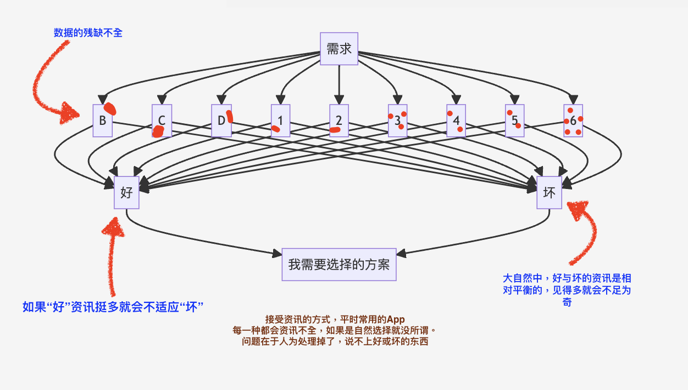
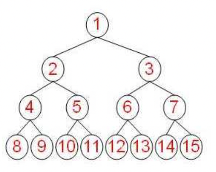
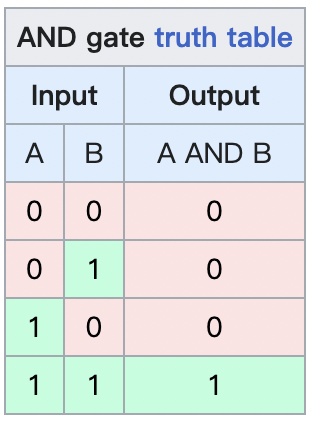
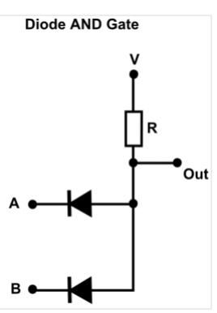

public:: true

- ## 思考的起点
	- 我们日常生活中需要接受许多信息，总的来说，我们都会在对我们“好”的，避开“坏”。那么这就是两个分类Category。
	  
	  好与坏很多时候是个人观点决定的。
	  
	  那么我们就说说不可辩驳的东西，数据。
	- ----
	- 纯数字：
		- 大，小
	- X，Y坐标，三角函数：
		- 更精确的表达平面中的数据关系，2D，两个点之间的距离，远近
	- XYZ坐标
		- 三维，在生活中的表现就是，上下左右，前后
	- 情绪：
		- 喜怒悲伤
- ----
- ## 现实
	- 现实中的生活是复杂的，我们说的话中会有许多情绪，太直白表达，直白就容易伤人，婉转呢，听着舒服，但也可能有的人听不懂。
	  
	  所以一句话中更可以包含许多复杂的情绪，一段文字也是。
	  
	  许多东西为什么值得玩味，就是因为难以概括的“耐人寻味”。
	  
	  为什么数学公式难懂，因为数学家总喜欢用最精简方式表达一个逻辑关系。就像我们也喜欢用简单的话概括一件事。
	  
	  因为方便记忆。
	  
	  方便理解的东西话多，方便记忆的东西话少。就像学习阿布的交易，当看惯简写之后，你会发现看英文或中文完整版特别费眼睛。
	  
	  想象一下MTR HL LH 换成语言解释。
	- ### 行为与数据的关系
		- {:height 489, :width 788}
-
- ## 程序的设计
	- 程序就是将一大堆中性的资讯收集并且处理，方便人使用。
	  
	  机器是笨的，比如电灯的开关，就是01，01规则上叠加上去，就会出现更复杂的逻辑。
		- {:height 352, :width 387}
			- *二叉树 Binary Tree*
	- 假如我们要表达“与”这个概念，让机器理解就要比较麻烦的过程，下面是电路与表格的表达方式。
		- {:height 407, :width 288} 
	- ---
	  虽然笨，但是精确，没有了似是而非。
	  
	  这里可以延伸到，看英文书的方法，和中文的方法。
	  
	  英文翻译书，通常就是一大堆叙事的流水账，非常像二叉树，从细枝末节开始一点点推理上去。
	  
	  而中文概括性强，喜欢从上面开始说。但是如果没有真实的数据做参考容易，自说自话。
	  
	  现实的表象本来就是难以琢磨和理解的，是一种原始数据，人为了方便理解，尝试用语言，数学去描述。
	- {:height 385, :width 435} {:height 336, :width 265}
		- *大自然中的分形*
		-
		- ### 需求决定设计
			- ### 需求
				- _1696058329682_0.png){:height 558, :width 476}
				- 我们一天中都有各种各样的需求，而马斯洛尝试将这些需求进行分类。（类似上面的数学案例）
				  
				  比如，遇到你之前，我特别不注重吃饭，遇到你之后我就开始稍微注意些了。
				  
				  现在每次饿了都会想，如果是你你会买啥吃的。以前我是永远次那几样。根本想不到我有更多选择。（当然这也与我认为食物不那么重要有关）
				  
				  产生的后果就是：可能就是一碗牛肉汤饭的问题，但是却让我郁闷很久。
				  
				  可能是洗个澡就能获得的幸福，我却忘了。
				  
				  所以我常常说，因为你让我更加知道如何去努力做好一件事，也因为你我更加希望做的更好。Method and desired，方法和欲望。
				  
				  对我来说，欲望是让人本能性的特别想做这件事，即使再难也想做。
				  
				  就像很多人认为打工能让他生活幸福一样。欲望增加了我的需求，而我却没有好的方法去解决我的问题。
				  
				  所以我非常努力的寻找，虽然知道交易很有钱途，但是却苦苦找不到方法学。
				  
				  感觉已经找到了很好的资源，社区，可是自己却还是无法理解。
				  
				  后来发现，交易是恨不得比上医学院还要难的事情。所以我对自己的行为大改特改，大修特修，不断的重塑自己。情绪也因此起起落落。
				  
				  从童年的经历联想到身边所有的事情，尝试用围棋，跑步，用各种奇怪的东西，就是为了让自己的大脑高效率的活动起来。
				  
				  那种感觉就像，你能看到20公里的终点，但是却发现自己腿软，然后各种办法让自己动起来。
				- 渐渐的我开始看清这个世界，所以开始希望与不同国家人交谈，从过度表达，又回归到更理性，更清晰的表达。
				  
				  从以前落后的工作模式，进化成一套完整的体系，渐渐的理解了，原来阿布那一套是一种做实验研究的科学方式。
				  
				  又意识到，虽然我努力避免许多资讯上的坑，但之前还是在一套错误的思维逻辑在努力，导致有心无力，停滞不前。
				  
				  比如Context，我注意到仰智每次看书，都会大概了解作者人生的背景还有亚马逊上面的英文评价。
				  
				  而很多时候，英文区叫好的书，中文区却会一片差评。
				  
				  当然不是说人坏，而是发现，原来我们的语言中有许多问题。比如我们常常会把中性的词当作贬义，这种褒贬混淆的情况很大程度造成了问题。
				  
				  然而，往往好的学校职业经历出来的人，往往不太敢乱说话，说错了会失去社会上的信用，我们的社会没有太多这种问题。
				  
				  为什么阿布的那套教学又有书，视频，还有几千张幻灯片？其实就是为了更好的方便大家理解他的方法。
				  
				  声音，画面，幻灯片这是更加方便搜索，调取历史资讯。就是为了表达情绪所做的努力。
				  
				  这里就终于，回归到了什么是“设计”
				  ---
			- ### 设计
				- 设计最重要的问题就是，解决沟通问题。就像所有人都希望一本书能学会赚钱的秘技。
				  
				  如果能一句话解决的事情，就不用一篇文章。
				  
				  能让用户自己玩懂的，就不用语言教。
				  
				  让大家最本能的消除信息差异。从而提高生活品质。
				  
				  那么就要一个要求，设计者首先要有这样的需求，理解这样的需求。
				  
				  比如在处理老屋wiki的时候，我给自己的要求就是，在力所能及，开心，还有能让自己的工作学习更方便的情况下才做这件事情。
				  
				  从构思到整个项目的完成，让我感觉到了极大的成就感。而且，我的生活还变得更简单了。并且还方便了其他志愿者更好的工作。
				  
				  所以，好的灵感，好的项目，好的构思，和匹配的知识水平很重要，现在回想起来，我多年前非常努力的学习真的没有白费。
				  
				  因为我学会了“提问的智慧”，我会绞尽脑汁的思考最合适的问题，一个足够清晰的表达就会解决足够具体的问题。
				  
				  最后发现，原来我们的语言中有许多不够清晰的问题，间接让我的英文，数学，编程能力提高了。
				  
				  所以设计一个问题，设计一个想法，创造一个激动人心的需求非常重要。
	-
- ## 思维训练
	- 阅读是很好的思维训练。
	  
	  有的文章值得细细品，比如像梁实秋的书，慢慢的看就很有滋味。
	  
	  有的书适合快速刷，比如很多外国翻译的书，但是不代表这书没意义，而是写作方式，叙述方式，他们就像二叉树的分支，我们需要快速大概了解一遍，大概知道一下即可。
	  
	  但是这有个问题，我们从小到大教导的看书方式是，抠字眼，大声朗读，看不明白就一定要强迫自己看，然而有的东西文化背景不一样，你根本不可能理解的，只有你看了思考，再从其他地方了解了相关资讯才能理解。
	  
	  还有就是“质疑”是看书非常重要的一部分，我们的教育，不鼓励这一块，但是确实让学习变成乐趣最重要的一点。（我知道我在以往的交谈中，这一块也做的不好，听到你的质疑经常会有情绪，但是“质疑”毋庸置疑是好的。）
	  
	  书这个东西非常有趣，许多作者会把多年的知识与思考尽可能的阐述，所以就会形成深度对话。
	  
	  看不懂的内容也不要担心，就像看电视剧一样，你不会硬让自己去背细节。
	  
	  还有看翻译书，外文是很难翻译的，所以无论如何修饰都会怪怪的，所以大概理解即可，因为思维模式是非常不一样的，所以不能用读中文书的办法，要像听一个老外在讲中文，然后你在努力弄懂他在说什么。英文许多句子很长，包含许多细节，但又由于细节太多，让读者不知道到底他希望表达什么。
	-
	- ### 一切以开心为目的
		- 较劲的去看会特别为难自己。所以这几年我希望你没上班，就是希望你能好好放松，虽然效果未必如意，但是我想也还是有些用的。刚认识你时，我注意到了你压力很大，身体也不好，我知道放松是最好解决这些的方式。（当然中间还是许多考虑不周）
		-
		- 还有一个值得提到的是，了解我们阅读速度的极限。比如说话1分钟500字基本上就是极限了。（比如我之前有听书，但是后来发现听一天下来耳朵难受，最后就还是，阅读来解决。）
		  
		  看书快会给人看视频般的乐趣，而且更加有趣，收集书本有趣的章节也是的。比如我喜欢看英文翻译的书，很多时候这样可以帮助我跟不同语言的人沟通，因为那些传承几十上百年的文章，说服力要比我的话更强。而且还能很快拉近人与人之间的关系。
		  
		  如果，只是阅读，就可能去到3000以上。（速度只是测试，阅读永远以愉悦为主，如果能让我们减少看低质量的视频那更好，但是也不要有压力。）
		  
		  ---
	- ### 视频
		- [說話最快的人 打破金氏世界紀錄 美國男子1秒噴11英文字 - YouTube](https://www.youtube.com/watch?v=01HiNLiu7ts)
		- [✒️ 如何速讀：輕而易舉的閱讀讓你每分鐘過「萬」字｜學習的知識#12【閱部客】 - YouTube](https://www.youtube.com/watch?v=xx3pnr4Woeg)
	-