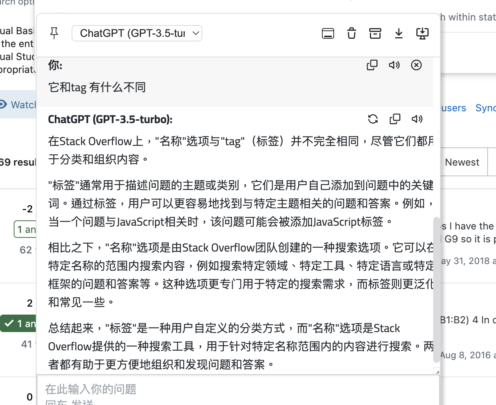

public:: true

- {:height 471, :width 718}
- 终于去了一次观澜，很久之前分享过给你看的一片文章[[“木脑壳”的八次逃港传奇]] 最后那两夫妻晚年就是在观澜度过的。
  
  当时看完，觉得有点像我们两个。  
  
  这家店的莲藕汤里的藕就是你喜欢的粉藕，观澜这里比龙岗墟还要舒服，旁边有河边可以走。  
  
  走的过程，有回想起一件事情。之前我们两个人状态最不好时，走在街上，我看到你我都情绪不好，而街上的行人则很开心的模样。  
  
  让我非常的难过，因为我感觉，你曾经就是如此开心，我做的一切都错了吗？  
  
  这种自我怀疑非常折磨，会瞬间击垮自己。
- ---
- **幸福**
	- 这会陷入一种非常难以解释的境地：为什么是快乐？什么是幸福？如果无知能更快乐，为什么还需要知识？到底了解更多是否真的能让我们走向幸福？
	- #+BEGIN_QUOTE
	  来自ChatGPT的回答  
	  "快乐"和"幸福"是涉及到人类情感和心理状态的复杂主题。虽然它们在某种程度上可以相互关联，但它们也有一些不同之处。  
	  	    
	  快乐通常指的是一种短暂的情感状态，它与积极的感受和愉悦的体验相关。快乐可以源于满足基本需求、获得成功、享受欢乐时刻等。它可以是一种瞬间的喜悦，比如笑声、享受美食、交往朋友等。快乐是一种情感体验，它可以是生活中的一部分，但它可能是暂时的，而不是持久的心境。  
	  	    
	  幸福则更多地指的是一种长期、持久的主观感受和整体生活满意度。幸福通常与个人的生活满意度、目标达成、意义感和心理健康有关。它涉及到个体对自己的生活状态、关系、成就和意义的整体评估。幸福更多地与长期的心理状态和生活体验相联系。  
	  	    
	  至于为什么需要知识，明白尽可能多的事情并不是为了追求快乐，而是为了实现个人成长和全面发展。知识可以扩宽我们的视野，培养我们的批判性思维和判断力，提高我们的问题解决能力。通过学习新知识，我们能够更好地理解世界、他人和自己，从而更好地应对生活中的各种挑战和困境。  
	  	    
	  了解更多也可以帮助我们发现新的兴趣爱好和追求个人意义的事物，增加生活的丰富性和深度。它可以培养我们的好奇心和创造力，并提供个人成就和自我实现的机会。知识不仅可以为我们提供工具和资源，还可以为我们提供更大的自由度和选择权，让我们更好地把握自己的人生。  
	  	    
	  然而，需要强调的是，快乐和幸福是复杂而个体化的概念，每个人对于快乐和幸福的追求都有所不同。了解更多并不是唯一的路径，达到幸福。每个人都有自己独特的价值观和需要。重要的是找到平衡，根据自己的兴趣、需求和价值取向，在各个方面寻找满意和幸福。专业的心理咨询师可以为你提供支持和指导，帮助你在追求幸福的道路上找到适合自己的方式。
	  #+END_QUOTE
- 所以后来我希望有更多关于哲学的解释，了解千百年前，其他思想巨人的思考。
  
  为什么要思考这些？因为我觉得这既是我交易上最重要的一道坎，也是我们之前的一道坎。当然我现在还无法找到一个很好的引用quotes，但就目前来看生活上已经进入了新的一种模式。  
  
  个人的感受是，越大的幸福需要越大的能力匹配，当在过渡期的时候人的表现是世界观崩塌，需要重塑后才会进入新的阶段。如果重塑很慢就会沮丧，卡在困境中。如果解决快就会有势如破竹的感觉。  
  
  刚刚开始势如破竹，还会有抑制不住的兴奋感，亢奋的感觉。  
  
  而且每个人，达到某个目标所要面对的困难其实都很不一样。就像学一样东西看起来书上就那些目录的东西，逐一学会即可，可以每个人的心理关卡是完全不一样的。而且越是难的课题，心理因素表现的越是明显。  
  
  而且越是难的知识，其实大部分都是公开的，就是因为不易理解，所以发布者会希望更多人看到。这样他的心血也就不会白费。  
  
  有的人，前期快，后期慢，有的则是厚积薄发。当然都是事后方知，没走出来之前都是迷惑的。  
  ---
- **从新介绍自己**
	- 最近我意识到一个问题，我的很大的困惑，来自于我从小接受的教育就很特别，当然不是抱怨，但我越来越觉得这是命运的安排。
	    
	  我一直处在一种不南不北，不中不西的境地。而且喜爱的东西都与大家不一样，但是我也非常费解。这种差异导致了许多问题。  
	    
	  我无法找到自己的定位，比如我能在Carpet群里面找到启发，后来又在一个印度的学习群找到启发。  
	    
	  我这种启发是让人自发的振奋的感觉。如获至宝。  
	    
	  以前以为别人跟我一样，所以容易察觉不到别人感受喋喋不休的说，大家说我是不懂得“察言观色”，后来发现，有的东西只有自己好理解，如果要表达还需要一个很强的表达能力，文字功底。  
	    
	  比如编辑维基百科的时候，我意识到了一个很重要的问题就是中立的语气。这个东西非常有技巧，因为我学的东西多，很容易说出语不惊人死不休的观点，而且是没有意识的情况下说出的，这样非常容易导致引发冲突。  
	    
	  有点像皇帝的新衣里面的场景。  
	    
	  就像点火，不小心烧了一片就搞的周身屎。这种问题其实全世界都有。文化越开放的地方相对好一些。  这本书里面讲的许多情况都与我许多过往的感受非常相似。  
	    
	  当然，这种能力不等于赚钱的能力。赚钱需要更加不一样的能力。  
	    
	  
	  #+BEGIN_QUOTE
	     
	  	  “黑客”这个词不仅是第一流能力的象征，还包含着求解问题过程中产生的精神愉悦或享受。也就是说，从一开始，黑客就是有精神追求的。自由软件基金会创始人理查德·斯托尔曼说：“出于兴趣而解决某个难题，不管它有没有用，这就是黑客。”  
	  	    
	  	  　　根据理查德·斯托尔曼的说法，黑客行为必须包含三个特点：好玩、高智商、探索精神。只有其行为同时满足这三个标准，才能被称为“黑客”。另一方面，它们也构成了黑客的价值观，黑客追求的就是这三种价值，而不是实用性或金钱。  
	  	    
	  	  1984年，《新闻周刊》的记者史蒂文·利维出版了历史上第一本介绍黑客的著作——《黑客：计算机革命的英雄》（Hackers: Heroes of the Computer Revolution）。在该书中，他进一步将黑客的价值观总结为六条“黑客伦理”（hacker ethic），直到今天这几条伦理都被视为这方面的最佳论述。  
	  	    
	  	  　　(1) 使用计算机以及所有有助于了解这个世界本质的事物都不应受到任何限制。任何事情都应该亲手尝试。  
	  	    
	  	  　　（Access to computers—and anything that might teach you something about the way the world works—should be unlimited and total. Always yield to the Hands-On Imperative!）  
	  	    
	  	  　　(2) 信息应该全部免费。  
	  	    
	  	  　　（All information should be free.）  
	  	    
	  	  　　(3) 不信任权威，提倡去中心化。  
	  	    
	  	  　　（Mistrust Authority—Promote Decentralization.）  
	  	    
	  	  　　(4) 判断一名黑客的水平应该看他的技术能力，而不是看他的学历、年龄或地位等其他标准。  
	  	    
	  	  　　（Hackers should be judged by their hacking, not bogus criteria such as degrees, age, race, or position.）  
	  	    
	  	  　　(5) 你可以用计算机创造美和艺术。  
	  	    
	  	  　　（You can create art and beauty on a computer.）  
	  	    
	  	  　　(6) 计算机使生活更美好。  
	  	    
	  	  　　（Computers can change your life for the better.）  
	  	    
	  	  　　根据这六条“黑客伦理”，黑客价值观的核心原则可以概括成这样几点：分享、开放、民主、计算机的自由使用、进步。  
	    
	  #+END_QUOTE 
	  ---
	  当然，除了“高智商”这一点之外，另外两点跟符合我对自己的感受。
	- ---
	- **喜好清单**
		- 歌手，音乐人，音乐在我人生许多重要的阶段都扮演了重要的角色，以下是简单的几个
			- John lennon
			- George Harrsion
			- Pink Floyd
		- 我初中的时候，就特别的喜欢古典音乐，在大家流行听周杰伦之前，我就在听周杰伦，可是大家开始听周杰伦之后，我开始受到周杰伦的音乐启发去听，爵士乐，古典乐，交响乐，以下是弹琴的
			- 郎朗--他弹琴有天赋，但是后来了解了一些行为就不这么喜欢了，不过他早期弹的曲子，英国王子都爱的不得了。
			- Richter
			  Dinu lipattie
			- Arthur Rubinstein
		- 作曲家有：
			- 贝多芬- 他的月光，悲怆，热情，奏鸣曲陪伴了我很久
			- 拉赫曼尼诺夫- No 2 钢琴协奏曲
			- 莫扎特 - 这个听的相对少
			- 柴可夫斯基 - No 1 钢琴协奏曲
		- 还有迪士尼的音乐合集，陪伴了我童年最重要的时光。所有的这些喜好都导致了我与大家的格格不入。
		    
		  这种感觉不是说我行我，自己开心就行。而是感觉到没办法找到与自己相似的人进行交谈，这种感觉非常难受。我注意到许多还喝酒的人也有类似感觉，只不过他们希望麻痹来缓解，我这是希望真正面对问题。  
		    
		  很多时候，我们感到苦恼唯一的办法就是解决问题，问题会像种子一样发芽生根，如果不面对就会难受。  
		    
		  而许多人告诉我，为什么要想这么多，这么复杂，这让我更加抓狂。让我感到似乎只有自己被一些问题烦恼。  
		    
		  我觉得很大一个原因在于，我的潜意识认为这些问题有解，一般人认为无解，而我的大脑随认为有解，但是无法找到合适的表达方式，我需要通过这种表达来让脑子更清晰。  
		    
		  这也是，我喜欢交易的原因，里面就怕你不问问题，只要问得好，可以收获一大堆回答。  
		  ---
- **对话式学习的重要**
	- 随着这一切的进步，我越来越意识到，我们小时候不喜欢“问题”学生的教育模式，是多么的毒害人心。良好的学习环境，如果你问得好，大家会很开心。
	    
	  我一直很喜欢收集那些，看似简单，但是却能引发话题的问题。  
	    
	  因为能引起共鸣非常重要。但是与人的交谈或者网络聊天，往往回应很慢，甚至问的不好会被无视也是常有的。对于不懂的人来说，这样容易打击人。  
	    
	  所以AI就充当了非常好的角色，所以我常常在脑子酝酿一个精巧的问题或者表达，然后丢给ai 整理或者回答，对答。  
	    
	  我发现随着这种处理的速度越来越快，人的许多能力都会得到快速的提升。  
	    
	  这也是我最近为什么一直在唠叨的重要性。随着这种能力的提升，最后会进化到与书本进行无声的交谈--》笔记--〉脑子的思绪开始练成一片--》恍然大悟。  
	    
	  这种就是现代版的“不耻下问”，ai会变成永远循循善诱的博学老师。而且三观比许多人都要正。  
	    
	  {:height 309, :width 423} {:height 357, :width 358}  
	    
	  这有个案例，右边是追问下，最终得到的我能理解的答案。  
	    
	  随着“恍然大悟”的增多，人的理解能力会急速提升，恍然大悟== 发自内心的喜悦  
	    
	  ---
- **理解的继续升级**
	- 当理解的东西就是，寻找更多灵感的时候了，当你理解的东西比绝大多数人多的时候，你就会开始回答别人的一些问题。
	    
	  如果回答的好，也会有成就感，而且别人信任你，也会展示更多自己。  
	    
	  比如我遇到的台湾人，印度人，就发现他们不耻下问的能力很强，你会发现，他们的底子好，学东西会快很多。  
	    
	  自己也能从他们身上得到非常多的启发。这就形成了良性循环。  
	    
	  我认为，许多人都没有意识到这种良性循环的威力，这里面包含非常强大的东西。  
	    
	  类似集体共识，智慧的感觉，互惠互助，随着问题越来越深，大家都会互相进步到更加深刻的境界。  
	    
	  而不是，偷学了好东西，就拿别人成果去BB，这种现象在国内有，但是台湾，英文社区比较好。  
	    
	  因为他们有一种共识，能理解“互惠”的感觉。而不是，捞了好东西就走。  
	    
	  当然，不是说国人素质差，而是大家不知道这背后蕴含的力量，因为国内全是互割韭菜的行为，大家形成了这种氛围。（我在这里发现国内教育行业真是商机无限，因为中文好的学习资源不多，很多时候我随手发表一小篇笔记都能收获不错的评价。努力创造物互联网ai中找不到的内容是非常让人兴奋的。）  
	    
	  所以，我不喜欢私下交谈，内容丰富的回答我都是放到公开场合，或者做成网页。这样也可以建立我的，公众形象（public image）  
	    
	  这样我也可以知道有多少人对我的分享有兴趣（也是让我学好编程的动力之一）。  
	    
	  ---
	-
- **有趣的视频**
	- [The KK Show - 216 小紅書演算法工程師 - Nick - YouTube](https://www.youtube.com/watch?v=cN07i8Puqzs)
	- [信息茧房逆天升级，普通人如何“破房”？【雪鸡观察局207】_哔哩哔哩_bilibili](https://www.bilibili.com/video/BV12P41187fs)
		- 这里有个非常值得关注的案例。同样的内容，男生女生下面的评论是完全不一样的。还会因为地区而不一样。
	- [特种兵式打游戏，专治电子阳痿_哔哩哔哩bilibili_上古卷轴](https://www.bilibili.com/video/BV1oz4y137oq)
		- 这里面让我想起来，最焦虑的那段时期，做任何事情都无法开心，这里有分享作者自己的处理方式。
	- [十年寒窗，终不敌三代努力！张雪峰谈苏州一小学， 40个孩子50个家长都是博士！！_哔哩哔哩_bilibili](https://www.bilibili.com/video/BV1Ph4y1Y7pQ)
	-
-